# Piedra-Papel-O-Tijera-Cachiripun-o-Cachipun-WIP
Cachiripun o Cachipun de un jugador o multijugador en red local(LAN) o remota con interfaz gráfica en Python.

## Cachipun Online y Offline
Juego de piedra, papel o tijera (cachipún) en red, con modo servidor/cliente.
Desarrollado con Python + Tkinter y comunicación mediante sockets TCP.
Pensado para jugar con amigos en LAN o a través de Internet (con reenvío de puertos o túneles).


## Características
* Modo online: Un jugador actúa como Servidor, el otro como Cliente.

* IP configurable para el servidor (puede escuchar en 0.0.0.0 o en una IP específica).

* Puerto fijo: 5000 (fácil de cambiar en el código).

* Interfaz gráfica atractiva con imágenes de piedra, papel y tijera.

* Revelación simultánea: ninguno ve la elección del otro hasta que ambos han jugado.

* Reinicio automático de la partida tras mostrar el resultado.

* Código abierto y licencia MIT para que cualquiera pueda contribuir o modificar.

## Instalación
**Para jugadores (solo necesitas el ejecutable)**
Descarga los archivos CachipunGameSinglePlayer.exe y CachipunGameMultiplayer.exe desde "<> Code" y ejecútalo.

**Requisitos:**

* Windows 7 o superior.
* Descargar la carpeta /resources desde el mismo repositorio para que el juego funcione y muestre las imagenes. Debe estar en el mismo lugar donde pusiste los dos archivos .exe.
* Conexión a Internet o red local para el modo online.
* Asegúrate de que el puerto 5000 esté abierto en el firewall (tanto en el servidor como en el cliente) para permitir la comunicación.

**NOTA: Si el servidor está detrás de un router, deberás redirigir el puerto 5000 en la configuración de tu router hacia la IP local del servidor, o usar herramientas como ngrok para exponer el puerto.**

**Para desarrolladores (ejecutar desde el código fuente)**
Si quieres ejecutar el juego desde el código .py o contribuir al proyecto:

**1. Clona el repositorio:**
```bash 
git clone https://github.com/tu-usuario/cachipun-online.git 
cd cachipun-online
```
**2. Instala Python 3.8+ (si no lo tienes) desde [python.org].**

**3. Ejecuta el juego:**
```bash
python CachipunOnline.py
```
**(NOTA: Asegúrate de que la carpeta resources/ esté en el mismo directorio que el .py, y que contenga las imágenes necesarias)**.

**4. (Opcional) Crear un ejecutable propio con PyInstaller:**
```bash
pip install pyinstaller
pyinstaller --onefile --windowed --name"[El nombre que tu quieras ponerle]" CachipunOnline.py
```
Assets requeridos
El juego utiliza imágenes en formato PNG dentro de la carpeta resources/. Si clonas el repositorio, las imágenes ya están incluidas.
Si las creas tú mismo, deben tener estos nombres (tamaño recomendado: 300×300 píxeles):

* blank.png

* rock_player.png

* paper_player.png

* scissor_player.png

* rock_computer.png

* paper_computer.png

* scissor_computer.png

## ¿Cómo jugar?
**Paso 1: Elige un rol en el menú principal:**

* Servidor (Jugador 1): inicia el juego y espera la conexión de un cliente. Se te pedirá la IP que tengas asignada (por defecto 0.0.0.0 para que el servidor acepte todas las conexiones que hay en LAN).

* Cliente (Jugador 2): conéctate al servidor ingresando su IP (local o pública).

**Paso 2: Una vez conectados, verás la pantalla de juego con tu área a la izquierda y la del oponente a la derecha.**

**Paso 3: Haz clic en uno de los tres botones (piedra, papel o tijera). Tu elección se mostrará en tu lado, y el oponente recibirá notificación de que has jugado.**

**Paso 4: Espera a que el oponente elija. Mientras tanto, verás mensajes como "Esperando al oponente..." o "El oponente ha elegido. Espera tu turno."**

**Paso 5: Cuando ambos hayan elegido, las dos imágenes se revelarán simultáneamente y aparecerá el resultado: ¡Ganaste!, ¡Perdiste! o Empate.**

**La partida se reinicia automáticamente tras 2 segundos para jugar de nuevo.**

**En cualquier momento puedes volver al menú principal pulsando "Volver al menú".**

## Configuración de red
* **Puerto: 5000 (TCP). Si quieres cambiarlo, edita la constante PUERTO en la línea 12 del código.**
* **IP del servidor:**
- En LAN, usa la IP local (ej. 192.168.1.10). Puedes obtenerla con ipconfig (Windows) o ifconfig (Linux/macOS).

- En Internet, necesitas una IP pública o un túnel (ngrok). Asegúrate de reenviar el puerto 5000 en tu router si usas NAT.

* **Firewall:** Tanto el servidor como el cliente deben permitir conexiones entrantes/salientes en el puerto 5000. En Windows, puede aparecer un aviso de Windows Defender; acepta para permitir la conexión.

## Tecnologías Utilizadas
* **Python: Lenguaje de programación principal.**

* **Tkinter: Biblioteca estándar para la interfaz gráfica de usuario (GUI).**

* **Sockets: Para la comunicación en red entre el servidor y el cliente.**


## Capturas del juego

**MODO SINGLEPLAYER**

### Menú principal del modo singleplayer
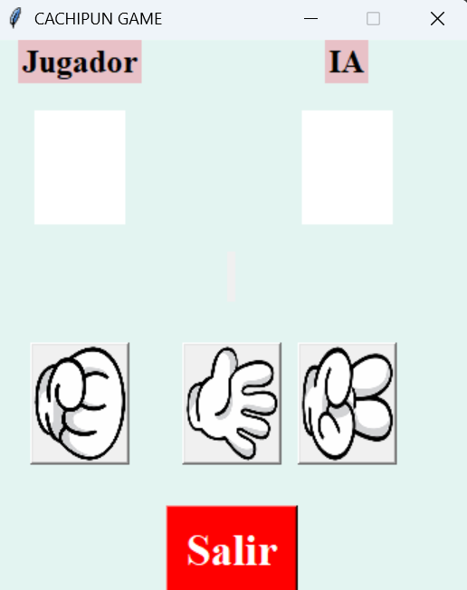

### Partida en curso: Se muestra el mensaje ¡Perdiste! si la IA adivinó tu movimiento


### Empate por si detectó que tú y la IA usaron la misma opción
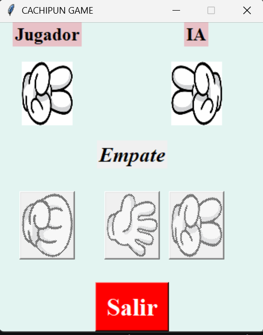

### Ganador si justo elegiste una opción y la IA eligió mal su movimiento
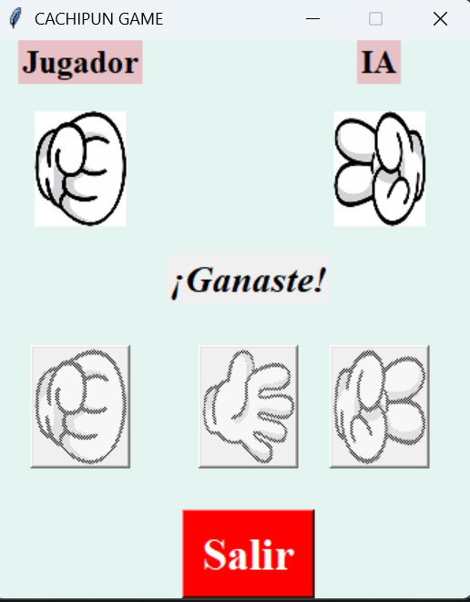

**MODO ONLINE**

### Menú principal del modo online
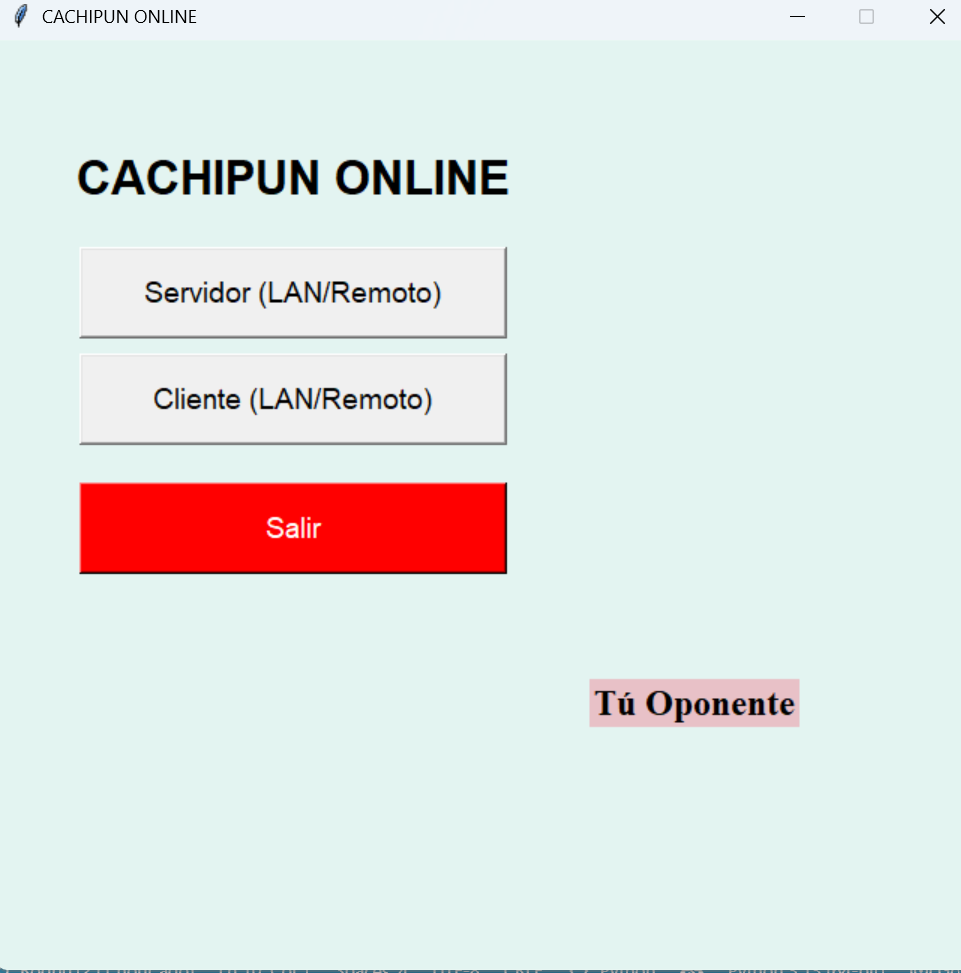

### Al apretar el botón de servidor para hostearlo
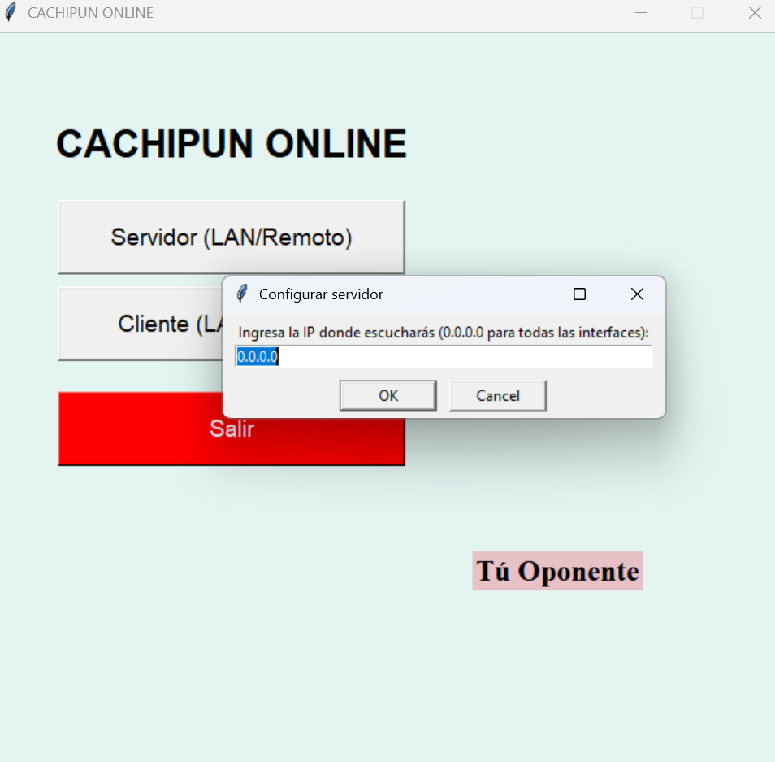

### Al apretar el botón del cliente para unirte al servidor
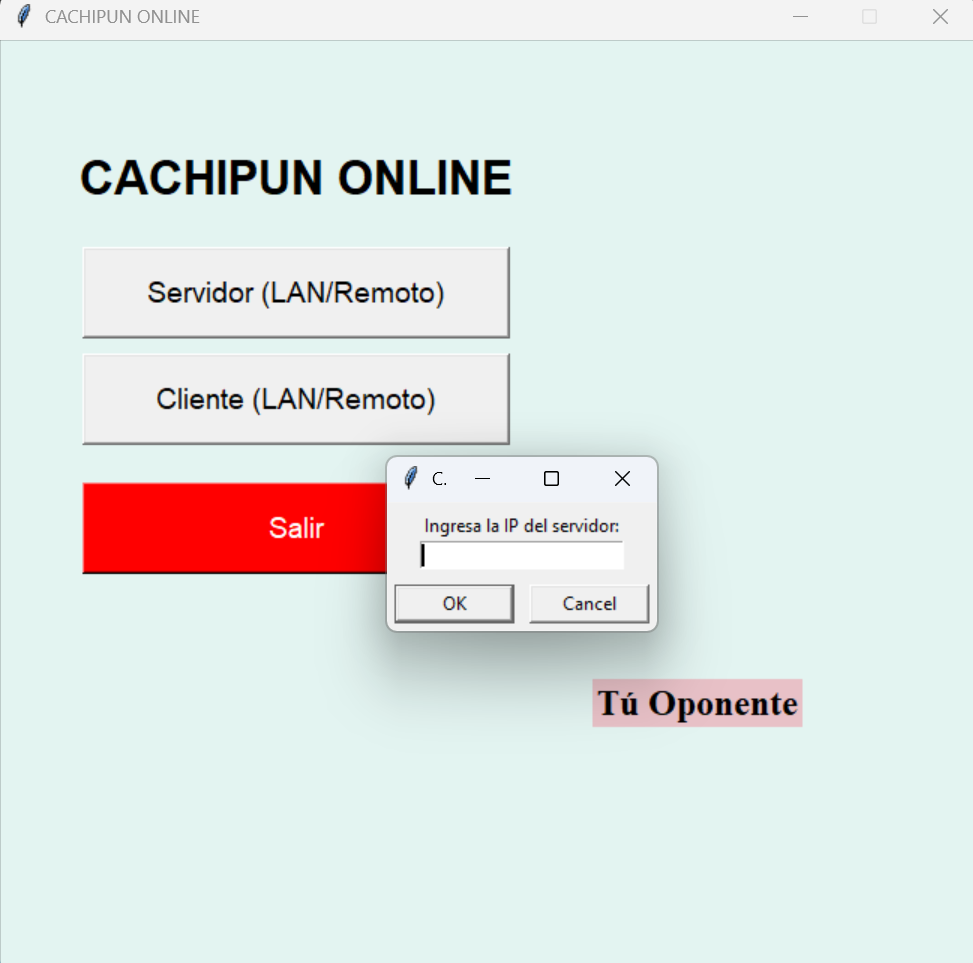

### Servidor esperando a que se conecte el cliente y hosteando desde la IP 127.0.0.1 para fines demostrativos (Jugador 1)
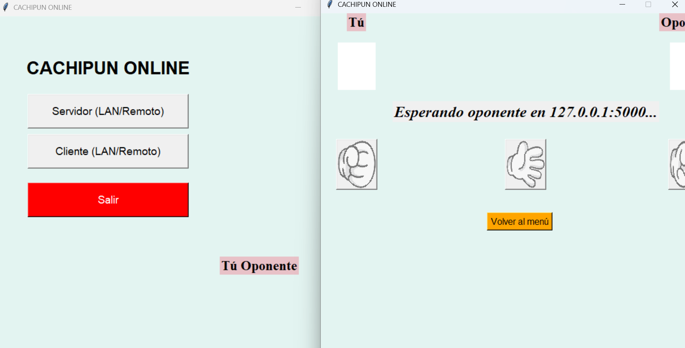

### Cliente conectado al servidor (Jugador 2)
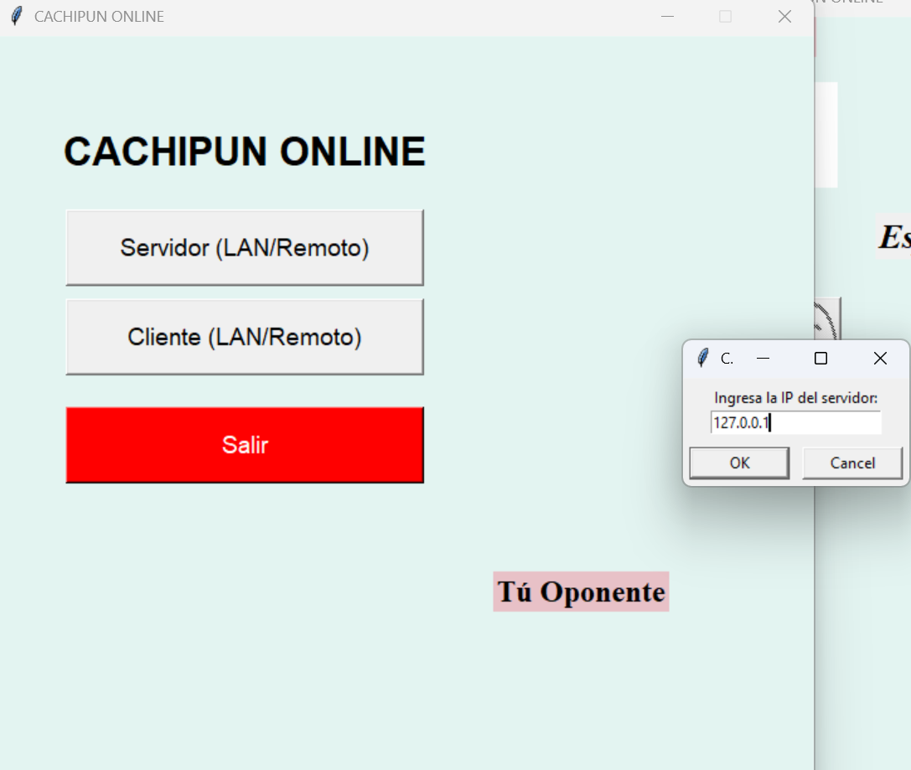
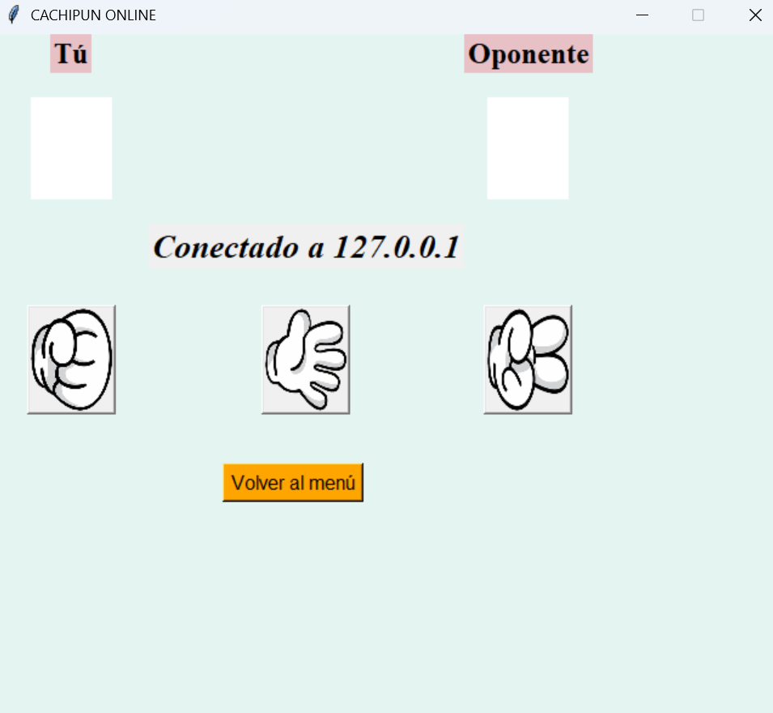

### Jugador 1 eligiendo su movimiento (el jugador 2 no puede ver la opción del otro, como en el juego verdadero)
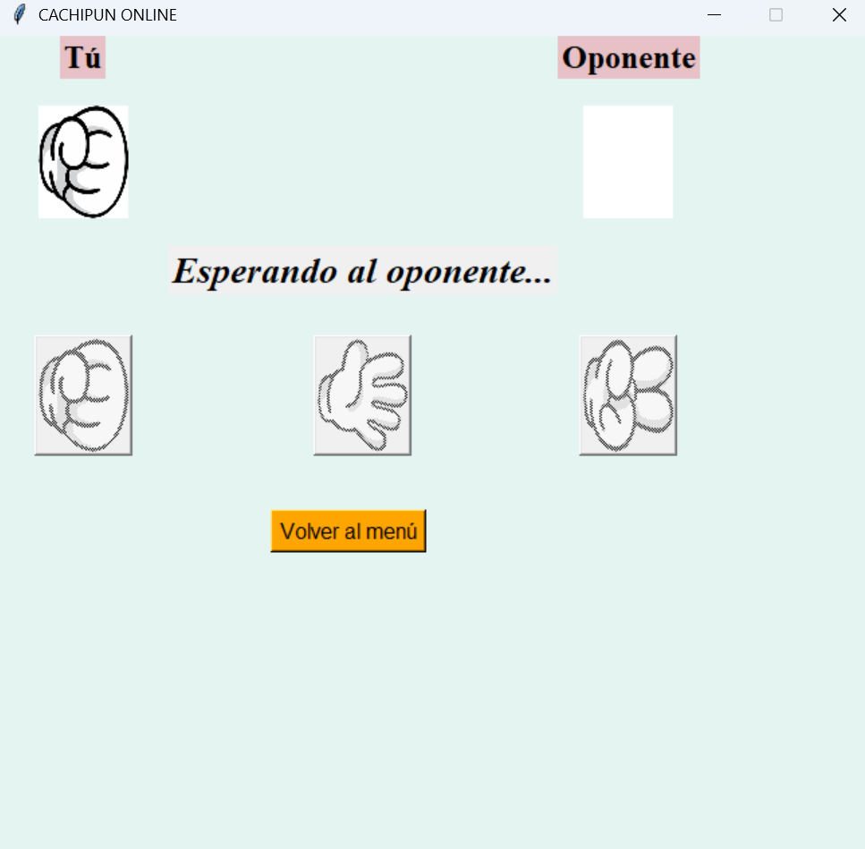
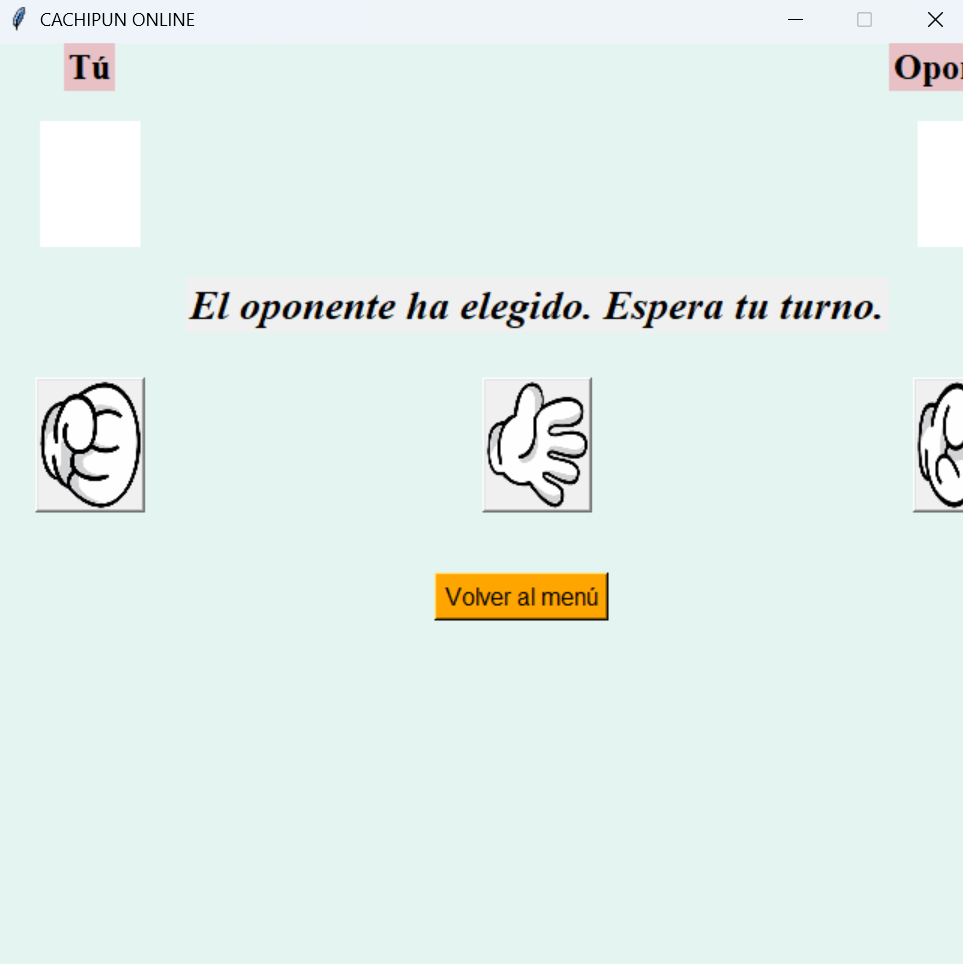

### Jugador 2 eligiendo su movimiento (aquí dependiendo de su elección se muestran los mensajes de ¡Ganaste!, ¡Perdiste! o ¡Empate!)
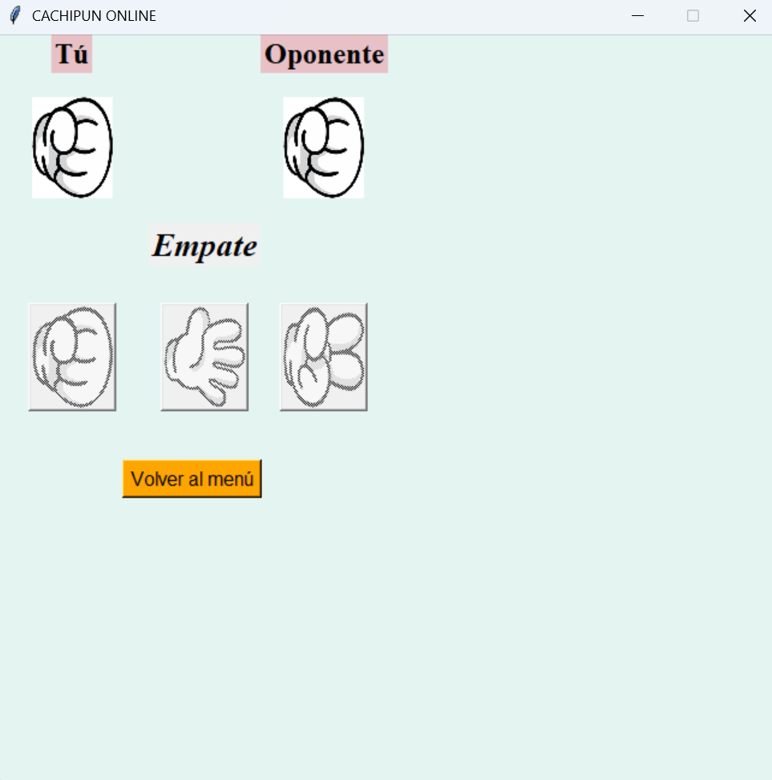

### Volviendo al menú principal


## ¿Dónde ver los cambios recientes?
Consulta el [registro de actualizaciones](CHANGELOG.md) para ver los cambios y mejoras recientes que se hagan durante este tiempo y ponerte al día.

## Contribuir
**¡Las contribuciones son bienvenidas! Para ello:**

* Abre un ISSUE en el repositorio y deja tus sugerencias o ideas de cómo puedo mejorarlo.
* Si no sabes como abrir un ISSUE, contáctame a este correo para las sugerencias o ideas que tengas: "rodriseralarcon98@gmail.com".

##  Licencia y Derechos de Autor
Este proyecto está bajo la Licencia MIT. Puedes usarlo para tu proyecto educativo en tu universidad o instituto en el que estudies. Esto significa que eres libre de usar, copiar, modificar, fusionar, publicar, distribuir, sublicenciar y/o vender copias del software, siempre y cuando se cumplan las siguientes condiciones:

El aviso de derechos de autor y este permiso deben incluirse en todas las copias o partes sustanciales del software.

**Copyright (c) 2026 Rodriu12**